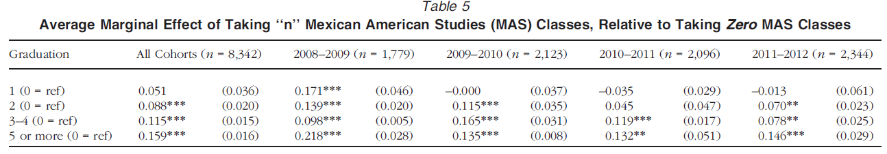

__Load libraries and data__


<!-- Code to enable scroll right for printing of data frames -->
<style>
pre code, pre, code {
  white-space: pre !important;
  overflow-x: auto !important;
  word-break: keep-all !important;
  word-wrap: initial !important;
}
</style>

_Note: code chunk omitted from html document using `include = FALSE`_

```{r, include=FALSE}
# uncomment below line to remove all objects
  #rm(list = ls())


# Options for how output of rmd file
  knitr::opts_chunk$set(echo = TRUE)
  knitr::opts_chunk$set(collapse = TRUE, comment = "#>", highlight = TRUE, warning = FALSE, message = FALSE)

  options(tibble.width = Inf, width = 10000) # Code necessary to enable scroll right for printing of data frames
  
# remove scientific notation
  options(scipen=999)

#-----------------------------------------------------------------------------
# Load libraries
#-----------------------------------------------------------------------------

library(tidyverse) # load tidyverse package
library(labelled) # load labelled package package
library(haven)


##########
########## ELS:2002 data
##########

# RUN SCRIPT THAT CREATES STUDENT-LEVEL DATA FRAME CONTAINING ALL VARIABLES AND CREATES DATA FRAME WITH A SUBSET OF VARIABLES

  #NOTE: this script will take 30 seconds to a minute to run because loading a dataset w/ about 16,000 observations and 4,000 variables from a website

  source(file = url('https://github.com/anyone-can-cook/educ152/raw/main/scripts/els/read_els_by_pets.R'))
  #source(file = file.path('.','..','..','scripts','els','read_els_by_pets.R'))
  rm(df_els_stu)
  rm(df_els_stu_all)

# Create data frame for analysis of effect of developmental ed math courses on college credits for students who start at CC
df_els_cc <- df_els_stu_fac %>% 
  # started at public 2-year
  filter(f3tzps1sec =='2-year public') %>% 
  # start year of first postsecondary institution (based on postsecondary transcript data) is at least one yar after year of HS graduation
  #filter(f3tzps1start>f3hscpdr) %>% 
  # first year of postsecondary education (based on transcript data) is 2004 or later
  filter(f3tzps1start>=2004) %>% 
  # started 2005 or later
  #filter(f3tzps1start>=2005) %>% 
# condition on variables not being missing
  # f3tzever4yr: ever attended a 4-yr
  # number of credits earned not missing
  # f1rmat_p number of high school math credits is not missiong 
  filter(f3tzever4yr != 'Missing', f3tzpostern != -9, f1rmat_p != 'Nonrespondent')

# Create data frame that consists of students who start at community college and have at least a one year delay between finishing high school and starting college
df_els_cc_delay <- df_els_cc %>% 
  # start year of first postsecondary institution (based on postsecondary transcript data) is at least one yar after year of HS graduation
  filter(f3tzps1start>f3hscpdr)
```

<span style="color:red"><b>Grade: /80<b></span>

__Overview__

<br>

Problem set 4 is the take-home final for EDUC152. As such, it is longer and more challenging than previous problem sets. Because this is a take-home final, we cannot answer questions except for providing clarification. If you need clarification on a question, please send us a DM and/or come to our office hours. 

The first part of the problem set asks to answer questions about the article by @RN3292:

- Cabrera, N. L., Milem, J. F., Jaquette, O., & Marx, R. (2014). Missing the (student achievement) forest for all the (political) trees: Empiricism and the Mexican American Studies controversy in Tucson. *American Educational Research Journal*, 51(6), 1084-1118.

The remainder of the problem set asks questions about the following research question, "What is the effect of taking developmental math courses in college ($X$) on student success ($Y$) for students who start postsecondary education at a community college and who have a delayed entry (at least a one-year delay between completing high school and starting college)?

- We will consider two different outcome variables, $Y$
  - (continuous) total number of credits earned in postsecondary education (across all insitutions attended)
  - (dichotomous) whether the student ever transferred to a four-year institution
- Developmental math courses, $X$, teach math skills that students are generally expected to learn in high school
  - These courses are sometimes referred to as "remedial" but I prefer the term developmental
  - Usually, students are assigned to developmental math courses based on their score in a placement exam or based on the recommendation of a community college guidance counselor
  - Generally, developmental math courses do not count for "college credit" but students must pass these courses before they can take college credit math courses
- Many researchers and policymakers have been critical about placing too many community college students in developmental math courses and recommend that most students should be placed immediately into college-level math courses.
- Our research question will assess whether taking developmental math courses helps or hinders the success of students who have a delayed entry to college (at least a one-year delay between completing high school and starting college)


<details><summary><span style="color:red"><b>Click here for tips on notation</b></span></summary>

<br>

Some questions will ask you to write out notation and/or equations.

You can write out notation/equations one of two ways: (1) using "inline equations," which begin with a dollar sign \$ and end with a dollar sign \$; *OR* (2) you can write out notation/equation in plain text without. We encourage you to try inline equations, but fine if you do not.

Tips on writing notation/equations using "inline equations':

- Make sure there are no spaces after the dollar sign \$ that begins the equation and no spaces before the dollar sign that ends the equation. 
  - For example, you would write out the notation for treated potential outcome like this: $Y_i(1)$
  - But this wouldn't work: $ Y_i(1)$
  - And this wouldn't work: $Y_i(1) $
- Special characters -- like greek letters -- within inline equations are referred to using special symbols that start with a backslash
  - e.g., "Beta" is `\beta`: $\beta$
  - "Mu" (symbol for population mean) is `\mu`: $\mu$
- Subscripts after a character or symbol are specified like this:
  - e.g., "Beta subscript 1" is `beta_1`: $\beta_1$
  - e.g., "Mu subscript Y" (referring to population mean of variable Y) is `\mu_Y`: $\mu_Y$
- "hats" are specified by wrapping the character/symbol within curly brackets `\hat{}` like this:
  - e.g., "Beta hat" is `\hat{\beta}`: $\hat{\beta}$
  - e.g., "Beta hat subscript 1" is `\hat{\beta}_1` (note that the subscript is not within the "hat"): $\hat{\beta}_1$
- "bars" are specified by wrapping the character/symbol within curly brackets `\bar{}` like this:
  - e.g., "sample mean of Y" is `\bar{Y}`: $\bar{Y}$
- Don't worry about getting it perfect and don't spend too much time trying to get it perfect; if you are trying, that is a great start! and fine to use inline equations for some notation/equations and plain text for others that you can't figure out.  

<br>

Tips on writing notation/equations in plain text

- Instead of writing $Y_i(1)$, you could write this: Y_i(1)
- Instead of writing $Y_i = \beta_0 + \beta_1X_i + u_i$, you could write this: Y_i = beta_0 + beta_1*X_i + u_i
- Instead of writing $\hat{Y_i} = \hat{\beta}_0 + \hat{\beta}_1X_i$, you could write something like this: Y_hat_i = beta_hat_0 + beta_hat_1*X_i
- don't worry if it doesn't look pretty!

</details>
<br>


# Part I: Questions about @RN3292

<span style="color:red"><b>/2<b></span>

#### 1. In a couple sentences, what was the Mexican American Studies program and who was allowed to participate?

- __YOUR ANSWER HERE__:   


<span style="color:red"><b>/2<b></span>

#### 2. In social science research a "mechanism" is an explanation for why one variable ($X$) has a causal effect on another variable ($Y$). In your own words, what are 2-3 mechanisms for why participation in the MAS program would have a positive causal effect on the probability of graduating from high school

- __YOUR ANSWER HERE__: 


<span style="color:red"><b>/1<b></span>

#### 3. What does the conditional independendence assumption mean, in your own words?

- __YOUR ANSWER HERE__: 


<span style="color:red"><b>/2<b></span>

#### 4. What does omitted variable bias mean, in your own words? and what are the two conditions that must be satisfied for an omitted variable $Z$ to cause omitted variable bias? 

- __YOUR ANSWER HERE__:  


<span style="color:red"><b>/2<b></span>

#### 5. What is the connection between the conditional independence assumption and omitted variable bias?

- __YOUR ANSWER HERE__:  


<span style="color:red"><b>/1<b></span>

#### 6. If students had been randomly assigned to participate in MAS (as in an experiment), why would we be unconcerned about omitted variable bias?

- __YOUR ANSWER HERE__:  


<span style="color:red"><b>/3<b></span>

#### 7. In reality, students self-selected into MAS participation or non-participation. Think of one variable that might affect (positively or negatively) high school graduation *and* might be related (positively or negatively) to MAS participation? Why would this variable affect the probability of graduation and why might this variable have a relationship with participation in MAS? Why would we be concerned about our estimate of the effect of MAS based on a regression model that did not include this variable?

- __YOUR ANSWER HERE__:  


<span style="color:red"><b>/1<b></span>

#### 8. In observational data (unit x not randomly assigned to values of $X$), when researchers use regression to estimate the causal effect of $X$ on $Y$, explain the primary strategy researchers use to eliminate (or at least reduce) omitted variable bias?

- __YOUR ANSWER HERE__: 


<span style="color:red"><b>/2<b></span>

#### 9. The "linear probability model" basically means applying ordinary least squares (OLS) regression to a dichotomous (0/1) outcome variable as opposed to a continuous outcome variable. In the linear probability model, what is the "generic" interpretation of $\hat{\beta}_1$ when $X_1$ is a categorical variable?

- __YOUR ANSWER HERE__:  


<span style="color:red"><b>/4<b></span>

#### 10. Below is a partial screenshot of Table 5 from @RN3292, where the dependent variable is a dichotomous measure of whether the student graduated from high school, and the independent variable of interest is a categorical measure of the number of MAS courses taken (reference group is zero MAS courses). Each column in Table 5 is a different regression model. Interpret the coefficients for the "All Cohorts" model in words




- __YOUR ANSWER HERE__:  


# Part II: Effect of developmental math on college credits

The code chunk below shows some descriptive statistics about the variables in the model. 

- The data frame we will use is `df_els_cc_delay`
  - each observation $i$ is a student
  - consists of students who started postsecondary education at a community college and who had at least a one-year delay between finishing high school and starting college
  - all categorical variables are factor class
  - Note: the data frame `df_els_cc` is the same as `df_els_cc_delay` but includes students who started at community college with no delay after finishing hich school
- The dependent variable, $Y$, is a continuous measure of the total number of postsecondary credits earned, across all institutions
  - measured by `f3tzpostern`
  - variable label: `r attr(df_els_cc_delay$f3tzpostern, which = 'label')`
- The independent variable, $X$, is a three-categorical measure of number of developmental math courses taken. We have several alternative versions of this variable:
  - label for the variable `dev_math_cat3`: `r attr(df_els_cc_delay$dev_math_cat3, which = 'label')`

```{r}

# dependent variable: number of postsecondary credits
df_els_cc_delay %>% summarize(
  mean_pse_cred = mean(f3tzpostern, na.rm = TRUE),
  sd_pse_cred = sd(f3tzpostern, na.rm = TRUE)
)

# independent variable: taking developmental math courses

  # three category
  df_els_cc_delay %>% count(dev_math_cat3)

  # four category
  #df_els_cc_delay %>% count(dev_math_cat4)
  
  # dichotomous
  #df_els_cc_delay %>% count(dev_math_01)
```

<span style="color:red"><b>/2<b></span>

#### 1. Our goal is to estimate the causal effect of taking development math courses ($X$) on number of postsecondary credits earned ($Y$) for the population of students who start at a community college and who have at least a one-year delay between finishing high school and starting college. Recall that a "mechanism" is an explanation for why one variable ($X$) has a causal effect on another variable ($Y$). Give one explanation for why taking developmental math courses ($X$) might have a negative causal effect on number of postsecondary credits earned ($Y$) for our population of interest (one or two sentences is fine). Give one explanation for why taking developmental math courses ($X$) might have a positive causal effect on number of postsecondary credits earned ($Y$) for our population of interest (one or two sentences is fine).

- __YOUR ANSWER HERE__: 


<span style="color:red"><b>/8<b></span>

#### 2. Run the below model of the relationship between developmental math ($X$) and college credits earned ($Y$) with no control variables and then do the following.

Do the following:

- Write out the population linear regression model (make sure to define variables)
- Write out the OLS prediction line without estimate values
- Write out the OLS prediction line with estimate values
- Interpret the coefficients associated with developmental math in words
- For each coefficient associated with developmental math do we reject the null hypothesis $H_0: \beta_k = 0$ using an alpha-level (rejection region) of .05?
- Interpret the coefficient for $\hat{\beta_0}$ in words

```{r}
cred_mod1 <- lm(formula = f3tzpostern ~ dev_math_cat3, data = df_els_cc_delay)

summary(cred_mod1)
```

- __YOUR ANSWER HERE__:  


<span style="color:red"><b>/3<b></span>

#### 3. Define $R^2$ in words. Write out the mathematical formula for $R^2$ and interpret the value of $R^2$ from the above model in words

- __YOUR ANSWER HERE__: 


<span style="color:red"><b>/3<b></span>

#### 4. Explain what standard error of the regression (SER) means in words, write out the formula for SER (in terms of SSR), and interpret the value of SER from the above model in words

- __YOUR ANSWER HERE__: 


<span style="color:red"><b>/3<b></span>

#### 5. Explain what sample standard deviation of a variable means in words and write out the formula. Interpet the value of standard deviation for the variable `f3tzpostern` (given below) in words. Using your judgment, does our regression model make our predictions about the value of `f3tzpostern` substantially better than just using the sample mean of `f3tzpostern`?


```{r}
# standard deviation of Y
sd(df_els_cc_delay$f3tzpostern, na.rm = TRUE)

# Standard error of the regression
summary(cred_mod1)$sigma
```

- __YOUR ANSWER HERE__: 


<span style="color:red"><b>/4<b></span>

#### 6. Now, we will start adding "control" variables to our model. We will add ,`bytxmstd`, a continuous measure of high school standardized math score, and `f2everdo` a dichotomous categorical measure of whether the student ever had a "dropout episode" in high school. Run the below code which provides descriptive statistics of these variables. Separately for each of these variables, answer the following: Why might this variable satisfy the fist condition of omitted variable bias? Why might this variable satisfy the second condition of omitted variable bias?

- __YOUR ANSWER HERE__:  


Descriptive statistics

```{r}
# continuous control, high school math standardized test score
df_els_cc_delay %>% summarize(
  mean_hs_math = mean(bytxmstd, na.rm = TRUE),
  min_hs_math = min(bytxmstd, na.rm = TRUE),
  max_hs_math = max(bytxmstd, na.rm = TRUE),
  sd_hs_math = sd(bytxmstd, na.rm = TRUE)
)

# dichotomous measure of whether student ever had a dropout episode
df_els_cc_delay %>% count(f2everdo)

# dichotomous measure of whether student ever had a dropout episode, showing integer values rather than factor levels
df_els_cc_delay %>% count(as.integer(f2everdo))
```


<span style="color:red"><b>/10<b></span>

#### 7. Run the below model of the relationship between developmental math ($X$) and college credits earned ($Y$) with the inclusion of control variables, and then do the following:

Do the following:

- Write out the population linear regression model (make sure to define variables)
- Write out the OLS prediction line without estimate values
- Write out the OLS prediction line with estimate values
- Interpret the coefficients associated with developmental math in words
- Interpret the coefficient associated with high school math score in words
- For each coefficient associated with developmental math do we reject the null hypothesis $H_0: \beta_k = 0$ using an alpha-level (rejection region) of .05?
- Interpret the coefficient associated with "ever dropped out" in words
- Interpret the coefficient for $\hat{\beta_0}$ in words

```{r}
cred_mod2 <- lm(formula = f3tzpostern ~ dev_math_cat3 + bytxmstd + f2everdo, data = df_els_cc_delay)

summary(cred_mod2)

#summary(lm(formula = f3tzpostern ~ dev_math_cat4 + bytxmstd + f2everdo, data = df_els_cc_delay))
#summary(lm(formula = f3tzpostern ~ dev_math_cat4 + bytxmstd + f2everdo, data = df_els_cc))
```

- __YOUR ANSWER HERE__:


<span style="color:red"><b>/2<b></span>

#### 8. With respect to the above model, interpret the value of $R^2$ in words (fine to use "R-squared" rather than "adjusted R-squared") and interpret the value of SER in words

- __YOUR ANSWER HERE__: 


<span style="color:red"><b>/4<b></span>

#### 9. Choose two additional control variables that you think satisfy both conditions of omitted variable bias that you will add to the model. Separately for each of these two variables, answer the following: why might this variable satisfy the fist condition of omitted variable bias? Why might this variable satisfy the second condition of omitted variable bias? If the variable is categorical, which category will be used as the "reference category" when we include this variable in a regression model?

Note: to help you think of control variables you might add to your model, the below code shows variable labels associated with each variable (output omitted)
```{r, include=FALSE}
df_els_cc_delay %>% var_label()
```


- __YOUR ANSWER HERE__: 


<span style="color:red"><b>/2<b></span>

#### 10. Run the regression model with the inclusion of the two new control variables you identified above. Create an object called `cred_mod3` with the results of this regression model and then summarize the object `cred_mod3`. 

_Note_: if you are having trouble adding variables to your model or the output looks odd, send a DM on slack to Patricia Martín for help.

```{r}

```


<span style="color:red"><b>/6<b></span>

#### 11. Answer the following questions based on the regression model associated with `cred_mod3`:

- Interpret the coefficients associated with developmental math in words
- For each coefficient associated with developmental math do we reject the null hypothesis $H_0: \beta_k = 0$ using an alpha-level (rejection region) of .05?
- Interpret two coefficients associated with the new control variables you decided to add to your model
  - Note: If you added a categorical variable with six categories, this would be associated with five regression coefficients. You don't have to interpret the coefficients for all five coefficients. You could just interpret two of these coefficients.
  
- __YOUR ANSWER HERE__:  


<span style="color:red"><b>/3<b></span>

##### 12. Below we show the regression output associated with the model `cred_mod2` (control variables are high school math score and ever-droppoed out of high school). `cred_mod2` is based on the data frame `df_els_cc_delay` which includes students who started at a community college and had at least a one-year delay between finishing high school and starting college. We also show the regression output from the model `cred_mod2_allcc`, includes the same variables as `cred_mod2` but is based on the data frame which includes all students who started at community college, regardless of whether they delayed entry between high school and college. After running the below models, answer the following questions:


Questions to answer:

- Interpret the coefficients associated with developmental math from the model `cred_mod2_allcc`.
- In a couple of sentences, why do you think these coefficients are different than the coefficients from the model `cred_mod2`?

```{r}
cred_mod2 <- lm(formula = f3tzpostern ~ dev_math_cat3 + bytxmstd + f2everdo, data = df_els_cc_delay)

summary(cred_mod2)

cred_mod2_allcc <- lm(formula = f3tzpostern ~ dev_math_cat3 + bytxmstd + f2everdo, data = df_els_cc)

summary(cred_mod2_allcc)
```


- __YOUR ANSWER HERE__:  


# Part III: Effect of developmental math on transfer to 4-yr

The below code shows descriptive statistics for the dichotomous variable `f3tzever4yr`, which identifies whether the student ever attended a 4-year institution, for our sample of students who started at a community college and had at least a one-year delay between finishing high school and starting college
```{r}
df_els_cc_delay %>% count(f3tzever4yr)
```


The below code runs a model of the relationship between developmental math ($X$) and a dichotomous measure of whether the student ever transferred to a four-year institution ($Y$), controlling for high school math score and whether the student ever dropped out of high school.

```{r}
transfer_mod1 <- lm(formula = as.integer(f3tzever4yr) ~ dev_math_cat3 + bytxmstd + f2everdo, data = df_els_cc_delay)

summary(transfer_mod1)
```

<span style="color:red"><b>/8<b></span>

##### 1. Based on the above model:


Do the following:

- Write out the population linear regression model (make sure to define variables)
- Write out the OLS prediction line without estimate values
- Write out the OLS prediction line with estimate values
- Interpret the coefficients associated with developmental math in words
- For each coefficient associated with developmental math do we reject the null hypothesis $H_0: \beta_k = 0$ using an alpha-level (rejection region) of .05?

- __YOUR ANSWER HERE__:  

 
  

# Part IV: BONUS question (OPTIONAL)

<span style="color:red"><b>/10<b></span>

What are some things we should do (e.g., different dependent variable, additional controls varaibles in our model, additional sample restrictions) to improve the analysis so we would feel comfortable making policy recommendations based on this analysis?

- Write at least a paragraph or two to explain your reasoning.


# Part V: Post a comment/question

<span style="color:red"><b>/2<b></span> 

- Go to the class [#problemsets ](https://app.slack.com/client/T01S30RQY2E/C01SH5DSNEN) channel and create a new post.
- You can either:
  - Share something you _learned_ or a _question_ from this problem set. Make sure to mention the instructors (@ozanj, @Patricia Martín).
  - Respond to a post made by another student.


# Knit to html and submit problem set  

**Knit to html** by clicking the "Knit" button near the top of your RStudio window (icon with blue yarn ball) or drop down and select "Knit to HTML"

- Go to the [class website](https://anyone-can-cook.github.io/educ152/) and under the "Readings & Assignments" >> "Week 10" tab, click on the "Problem set 4 submission link"
- Submit both your html and .Rmd files 
- Use this naming convention "lastname_firstname_ps#" for your .Rmd (e.g. martin_patricia_ps4.Rmd)


# References