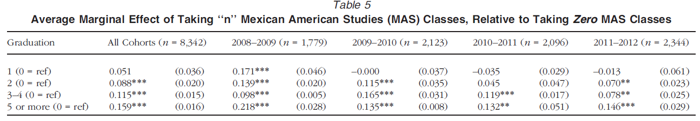

__Load libraries and data__

<!-- Code to enable scroll right for printing of data frames -->

# Questions about @RN3292

#### X. In a couple sentences, what was the Mexican American Studies program and who was allowed to participate?

- __YOUR ANSWER HERE__:  MAS was an interrelated set of courses offered at several schools within the Tucson Unified School district that students could opt in to starting in 11th grade. The program targeted low-income Mexican American students, and particularly students with low academic achievement. The program offered courses on language arts, literature, and history, with coursesdesigned to meet state standard but with a content focus on Mexican American culture and history. The courses were developed based on the work of "Paulo Freire (2000, 2008), especially the development of conscientizacxa˜o: the combination of critical consciousness, self-reflection, and engaging in antioppressive, collective action" [@RN3292, p. 1090]. 

#### X. In social science research a "mechanism" is an explanation for why one variable ($X$) has a causal effect on another variable ($Y$). In your own words, what are 2 mechanisms for why participation in the MAS program would have a positive causal effect on the probability of graduating from high school

- __YOUR ANSWER HERE__:  

- Students may be more engaged in learning literature and and history from the perspective of their own culture rather than learning Eurocentric history and literature. When students are more engaged in school, academic performance, attendance, and -- in turn -- and the probability of graduation is likely to increase.
- The Freire-based pedagogy, which encourages self-reflection and encourages students to view themselves as agents of change, may also increase engagement with school. In turn, increased engagement is likely to positively affect the probability of graduation.

#### X. What does the conditional independendence assumption mean, in your own words?

- __YOUR ANSWER HERE__:  The conditional independence assumption states that the independent variable of interest is unrelated to variables that have been omitted from the model that affect the outcome variable.

#### X. What does omitted variable bias mean, in your own words? and what are the two conditions that must be satisfied for an omitted variable $Z$ to cause omitted variable bias? 

- __YOUR ANSWER HERE__:  Omitted variable bias is bias $\hat{\beta_k}$ due to variables being omitted from the model. For an omitted variable $Z$ to cause omitted variable bias, $Z$ must: (1) affect the value of $Y$ *and* (2) $Z$ must have a relationship with the independent variable of interest.

#### X. what is the connection between the conditional independence assumption and omitted variable bias?

- __YOUR ANSWER HERE__:  The conditional independence assumption is violated because the model excludes variables that satisfy both conditions of omitted variable bias.

#### X. If students had been randomly assigned to participate in MAS (as in an experiment), why would we be unconcerned about omitted variable bias?

- __YOUR ANSWER HERE__: For omitted variable bias to occur, both conditions of omitted variable bias must be satisfied. If students had been randomly assigned to values of the MAS participation variable, then there can be omitted variables that affect the value of $Y$ (the first condition of omitted variable bias) but by definition these omitted variables can have no relationship with the MAS participation variable (the second condition of omitted variable bias) because values of MAS participation are determined by the flip of a coin.

#### X. In reality, students self-selected into MAS participation or non-participation. Think of one variable that might affect (positively or negatively) high school graduation *and* might be related (positively or negatively) to MAS participation. Why would this variable affect the probability of graduation and why might this variable have a relationship with participation in MAS? Why would we be concerned about our estimate of the effect of MAS based on a regression model that did not include this variable?

- __YOUR ANSWER HERE__: Household income. First, household income affects the probability of high school graduation because low-income students may have to work and have less time to focus on school (first condition of omitted variable bias).  Second, the MAS program was designed to target low-income students (second condition of omitted variable bias) so there is likely a relationship between household income and program participaiton. Failure to include household income would result in (downward) omitted variable bias such that because the estimated effect of MAS participation is partially picking up the negative effect of being low-income on the probability of high school graduation.

#### X. In observational data (unitx not randomly assigned to values of $X$), when researchers use regression to estimate the causal effect of $X$ on $Y$, explain the primary strategy researchers use to eliminate (or at least reduce) omitted variable bias?

- __YOUR ANSWER HERE__:  The strategy to reduce omitted variable bias is to include "control" variables in the model that satisfy both conditions of omitted variable bias.

#### X. The "linear probability model" basically means applying ordinary least squares (OLS) regression to a dichotomous (0/1) outcome variable as opposed to a continuous outcome variable. In the linear probability model, what the the "generic" interpretation of $\hat{\beta}_1$ when $X_1$ is a categorical variable?

- __YOUR ANSWER HERE__:  The generic interpretation of $\hat{\beta}_1$ for the linear probability model when $X_1$ is a categorical variable is, "being in the “non-reference group” as opposed to the “reference group” is, on average, associated with a $\hat{\beta}_1 \times 100$ percentage point change in the probability of $Y=1$"

#### X. Below is a partial screenshot of Table 5 from @RN3292, where the dependent variable is a dichotomous measure of whether the student graduated from high school, and the independent variable of interest is a categorical measure of the number of MAS courses taken (reference group is zero MAS courses). Each column in Table 5 is a different regression model. Interpret the coefficients for the "All Cohorts" model in words

- __YOUR ANSWER HERE__:  text of answer
  - taking one MAS course as opposed to taking zero MAS courses is associated with a (.051*100=) 5.1 percentage point increase in the probability of graduating from high school.
  - taking two MAS courses as opposed to taking zero MAS courses is associated with a (.088*100=) 8.8 percentage point increase in the probability of graduating from high school.
  - taking 3-4 MAS courses as opposed to taking zero MAS courses is associated with a (.115*100=) 11.5 percentage point increase in the probability of graduating from high school.
  - taking 5 or more MAS courses as opposed to taking zero MAS courses is associated with a (.159*100=) 15.9 percentage point increase in the probability of graduating from high school.

# References